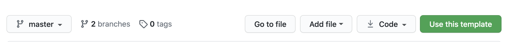

<<<<<<< HEAD
# Webpack Intro

[See Live Demo](https://webpack-temp.netlify.app/)

Webpack is a task runner and a module bundler. It originally started as a module bundler. This means that it takes all of your separate Javascript modules and bundles them together into a single file. Webpack also automates some of the tasks that we have to run every time we change the code. It will automate these tasks so that we are not typing in the same commands every single time.

- Visit the [Webpack documentation](https://webpack.js.org/concepts/) if you want to explore more.
- [Info on our Webpack Config](https://github.com/nss-nightclass-projects/Night-Class-Resources/blob/master/book-2-patterns-and-tools/chapters/webpack-configure.md)

## Get Started

### Use Template
#### 1. To get started, click the GREEN "Use this Template" button at the top of the repo


#### 2. Make sure YOUR github account is selected in the dropdown and name your project


3. Click the **GREEN** "Create repository from template" button
4. Clone your new repo to your local machine
5. Start working!

## Starting the Project
1. Open the `package.json` file and change the `name` property to the name of your application, and `author` to  your name.
1. From your command line, be in the root directory and run `npm install` OR `npm i` for short.
1. To start your application, run `npm start`

### If you see this, you are set to go!


**NOTE:** Changes you make to the project will make the browser reload on save...no more hard refresh unless something goes wrong.

## Other Important Tidbits
### Console messages
From this time forward, you will be expected to have a clean console in order for your assignments to be approved. This means that the use of `console.log` is acceptable **_(debugger is WAY better though)_** while developing, but will throw a warning in your console like the image below, but all `logs` will have to be removed. You may use `console.error` and `console.warn` in your code however.


### Including Images with Webpack
If you have a folder of local images that you want to load into your code things get a little strange with webpack.  Remember the only way webpack knows about assets is if they are imported into your javascript files.  Even our CSS is not added until those files are imported into our javascript files.  Below is some sample code for how to load a local image file into your project

```js
import cat from './assets/cat.jpg';

let domString = ``;

document.getElementById('cat').innerHTMl = domString;
```

### Importing CSS/SCSS
```js
import '../styles/main.scss';

const init = () => {
  $('#app').html('<h1>HELLO! You are up and running!</h1>');
  console.log('YOU ARE UP AND RUNNING!');
};

init();
```

### Using Axios
> For every file you will need to make an XHR request in, you will need to require Axios
```js
import axios from 'axios';

const examplePromise = () => {
  axios.get('http://localhost:3001/example')
    .then((data) => {
      console.warn(data);
    })
    .catch((error) => {
      console.error(error);
    });
});
```

### Deploying on Netlify

- Build Command: `npm run build`
- Publish directory: `build`
=======
# Chatty

## Setup

Every teammate copy and run the following commands in the host machine terminal.

```bash
mkdir -p ~/workspace/group-projects && cd $_
git clone [Github Classroom repo URL]
cd [repo name]
```

## SEE ISSUE TICKETS FOR ALL CRITERIA
1. Once your issues have been made available, create a Project Board and file each issue into either the TODO or Backlog, depending on tag (enhancement being a requirement, and BONUS being a stretch goal).
1. Check out the [simple wireframe](https://app.moqups.com/chortlehoort/uGBbLbK46Y/view/page/a3bd0c733) for this application on Moqups.com. You can make your final interface as fancy as you like, but keep the general layout similar to the wireframe.
1. Now, it is time to plan. You may not start until your project manager has given full approval.

### Navigation bar

1. Create an element to serve as the navigation bar for your application.
1. Create an element to hold the logo for your application. It can be as simple as text, but if you want to find an image, that's fine.
1. Create a input field for a user to enter in a message.
1. Add an event listener for "keypress" and detect when then return key has been pressed in the message field.
1. When return key is detected, you'll create a new message (*see details below*).
1. Create a button to clear all messages.
1. When the user clicks the clear messages button, all current chat messages should be removed from the application.
1. If there are no messages, then the clear messages button should be disabled (*see example above*).
1. The navigation bar should remain at the top of the screen, even if the contents of the page start to scroll.

### Options

1. Create two checkboxes below the message input field. One labeled "Dark theme" and the other labeled "Large text".
1. When the user clicks on the dark theme checkbox, change the background color of your application to a dark gray, and the font color for messages should be white(ish)... you pick.
1. If the user unchecks the box, the background color should change back to white with black text for messages.

### Messages
1. When the page is first loaded, you must load 5 messages from a module file and pre-fill a message area `<div>` below the input field that will also hold all new messages as they get created.
1. When the user presses the return key in the message field, the new message should be inserted into the message area.
1. The message should have a button displayed after it with the text "Delete" inside of it.
1. When the delete button next to a message is clicked, only that message should be removed from the DOM.

### Modular Code

Create multiple modules, following the Single Responsibility Principle, that perform the following functions.

1. One module should load the seed data file and returns the array of objects.
1. One module should contain a function that accepts an element `id`, and the user message, and then add the user's message - along with the delete button - to the specified parent element. Each message should be stored in a private array in this module. This module should also expose a function to read all messages, and delete a single message.
1. One module should accept a message element `id` and then remove the correct element from the DOM. This module should also remove the corresponding message from the private array that was created in the previous module.

## Helpful hints

### Adding listeners to dynamically created elements

When you add a DOM element to your page with JavaScript, you cannot add a listener to them directly in your code with `addEventListener`. This is because the element didn't exist when your JavaScript file got parsed and executed by the browser when it loaded. What you need to do is listen for the event on the `<body>` element, and then inspect what the target of the event is (i.e. which element the user actually performed the action on).

```js
document.querySelector("body").addEventListener("click", function(event) {
  console.log(event);

  // Handle the click event on any li
  if (event.target.tagName.toLowerCase() === "li") {
    console.log("You clicked on an <li> element");
  }

  // Handle the click event on any DOM element with a certain class
  if (event.target.className === "article-section") {
    console.log("You clicked on an `article-section` element");
  }

  // Inspect the `id` property of the event target
  if (event.target.id === "page-title") {
    console.log("You clicked on the page-title element");
  }
});
```

### Setting element attributes

You can use JavaScript to [set any attribute](https://developer.mozilla.org/en-US/docs/Web/API/Element/setAttribute) on a DOM element. You've seen how to add/remove classes with `classList.add()`, `classList.remove()`, and `classList.toggle()`, but you can also add `id`, `href`, `src`, or any other attribute.

Here's an example of how to add a `disabled` attribute to a button in the DOM.

```html
<button class="clear-messages">Clear messages</button>
```

```js
// This will disable the first button with a class of "button-message"
document.getElementsByClassName("clear-messages")[0].setAttribute("disabled", true);
```


## Bonus criteria

For you overachievers, once you've completed the basic criteria, take a stab at these.

### Multiple Data files

Instead of having one data file with five messages in it, break each message into its own data file. How do you handle loading them in succession?

### Editing

1. Let users edit an existing message. Add an edit button next to the delete button that, when clicked, will take the message and put it back in the message input at the top.
1. Once user edits the message and presses the return key again, the message text in the list should be updated.

### Custom themes

1. Add a button/link to the UI labeled "Change Theme".
1. Remove the existing elements for changing the theme.
1. When user click on Change Theme element, show a Bootstrap modal dialog box.
1. Inside the modal, show two color picker fields - one for background color and one for font color.
1. Add a *Save* and *Cancel* button to modal.
1. When user clicks *Save* apply the chosen colors.

### Multiple users

1. Create an object in your JavaScript that holds an array of names (*see example below*).
1. Next to the message input box, there should be a radio button group for each name in the list.
1. When a user enters a message, it should be prepended with the chosen user's name, in bold text.
1. Keep in mind that this will likely change the structure of your data file since the pre-loaded messages have to have this information on them.

```js
// User object
const users = [
  { id: 'user1', name: 'Xavier' },
  { id: 'user2', name: 'Joanna' },
  { id: 'user3', name: 'Gunter' },
  { id: 'user4', name: 'Sven' },
  { id: 'user5', name: 'Mackenzie' }
];
```

### Message limit

1. Only show the last 20 messages.

### Timestamp

1. Put a timestamp on each message.
1. Again, this will change the structure of your data file.

### Need inspiration?
[Dr. T's Cohort 21 Chatty Group Project](https://drteresavasquez.github.io/d21-group-chatty-justice_league/#)
>>>>>>> 5ee3ef0a93fba1c4d63f64666d669ce3febaa043
